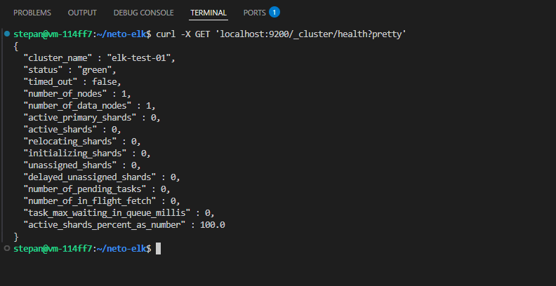
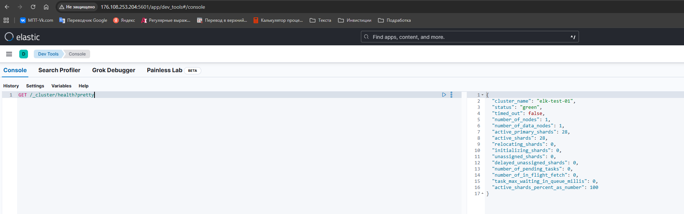
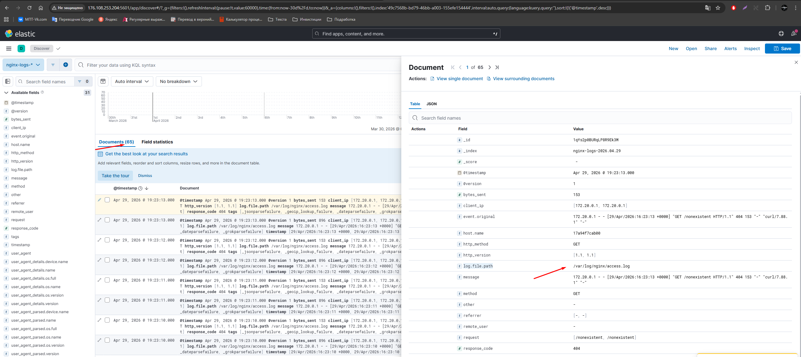
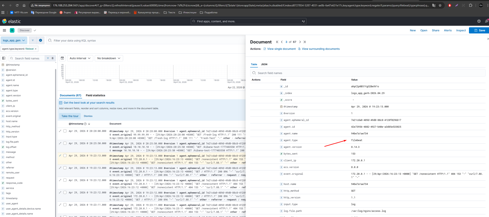

# Домашнее задание к занятию "`ELK`" - `Манукян Степан`


### Инструкция по выполнению домашнего задания

   1. Сделайте `fork` данного репозитория к себе в Github и переименуйте его по названию или номеру занятия, например, https://github.com/имя-вашего-репозитория/git-hw или  https://github.com/имя-вашего-репозитория/7-1-ansible-hw).
   2. Выполните клонирование данного репозитория к себе на ПК с помощью команды `git clone`.
   3. Выполните домашнее задание и заполните у себя локально этот файл README.md:
      - впишите вверху название занятия и вашу фамилию и имя
      - в каждом задании добавьте решение в требуемом виде (текст/код/скриншоты/ссылка)
      - для корректного добавления скриншотов воспользуйтесь [инструкцией "Как вставить скриншот в шаблон с решением](https://github.com/netology-code/sys-pattern-homework/blob/main/screen-instruction.md)
      - при оформлении используйте возможности языка разметки md (коротко об этом можно посмотреть в [инструкции  по MarkDown](https://github.com/netology-code/sys-pattern-homework/blob/main/md-instruction.md))
   4. После завершения работы над домашним заданием сделайте коммит (`git commit -m "comment"`) и отправьте его на Github (`git push origin`);
   5. Для проверки домашнего задания преподавателем в личном кабинете прикрепите и отправьте ссылку на решение в виде md-файла в вашем Github.
   6. Любые вопросы по выполнению заданий спрашивайте в чате учебной группы и/или в разделе “Вопросы по заданию” в личном кабинете.
   
Желаем успехов в выполнении домашнего задания!
   
### Дополнительные материалы, которые могут быть полезны для выполнения задания

1. [Руководство по оформлению Markdown файлов](https://gist.github.com/Jekins/2bf2d0638163f1294637#Code)

---

### Задание 1

`Задание 1. Elasticsearch
Установите и запустите Elasticsearch, после чего поменяйте параметр cluster_name на случайный.
Приведите скриншот команды 'curl -X GET 'localhost:9200/_cluster/health?pretty', сделанной на сервере с установленным Elasticsearch. Где будет виден нестандартный cluster_name.`

### Ответ

```
docker-compose

version: "3.9"
services:
  elasticsearch:
    image: elasticsearch:8.14.3
    environment:
      - discovery.type=single-node
      - xpack.security.enabled=false
      - cluster.name=elk-test-01
    ports:
       - 9200:9200
    volumes:
       - ./deploy/esdata:/usr/share/elasticsearch/data

```





---

### Задание 2

`Задание 2. Kibana
Установите и запустите Kibana.
Приведите скриншот интерфейса Kibana на странице http://<ip вашего сервера>:5601/app/dev_tools#/console, где будет выполнен запрос GET /_cluster/health?pretty.`

### Ответ

```
docker-compose

version: "3.9"
services:
  elasticsearch:
    image: elasticsearch:8.14.3
    environment:
      - discovery.type=single-node
      - xpack.security.enabled=false
      - cluster.name=elk-test-01
    ports:
       - 9200:9200
    volumes:
       - ./deploy/esdata:/usr/share/elasticsearch/data

  kibana:
    image: kibana:8.14.3
    ports:
      - "5601:5601"
    depends_on:
      - elasticsearch
    environment:
      - ELASTICSEARCH_HOSTS=http://elasticsearch:9200 
```




---

### Задание 3

`Задание 3. Logstash
Установите и запустите Logstash и Nginx. С помощью Logstash отправьте access-лог Nginx в Elasticsearch.
Приведите скриншот интерфейса Kibana, на котором видны логи Nginx.`

### Ответ

```
version: "3.9"
services:
  elasticsearch:
    image: elasticsearch:8.14.3
    environment:
      - discovery.type=single-node
      - xpack.security.enabled=false
      - cluster.name=elk-test-01
    ports:
       - 9200:9200
    volumes:
       - ./deploy/esdata:/usr/share/elasticsearch/data

  kibana:
    image: kibana:8.14.3
    ports:
      - "5601:5601"
    depends_on:
      - elasticsearch
    environment:
      - ELASTICSEARCH_HOSTS=http://elasticsearch:9200 

  logstash:
    image: logstash:8.14.3
    environment:
      XPACK_MONITORING_ENABLED: "false"
      ES_HOST: "elasticsearch:9200"
    ports:
      - "5000:5000"
    volumes:
      - ./logs:/var/log/nginx:ro
      - ./configs/logstash/pipelines:/usr/share/logstash/pipeline:ro
    depends_on:
          - elasticsearch
  
  nginx:
    image: nginx:latest
    ports:
      - "80:80"
    volumes:
      - ./logs:/var/log/nginx
    restart: always
```
Nginx.conf
```
input {
  file {
    path => "/var/log/nginx/access.log"
    start_position => "beginning"
    sincedb_path => "/dev/null"
    codec => "plain"
  }
}

filter {
  grok {
    match => { 
      "message" => "%{IPORHOST:client_ip} - %{USER:remote_user} \[%{HTTPDATE:timestamp}\] \"%{WORD:method} %{URIPATHPARAM:request} HTTP/%{NUMBER:http_version}\" %{NUMBER:response_code} %{NUMBER:bytes_sent} \"%{DATA:referrer}\" \"%{DATA:user_agent}\""
    }
  }
  
  date {
    match => [ "timestamp", "dd/MMM/yyyy:HH:mm:ss Z" ]
    target => "@timestamp"
  }
  
  mutate {
    convert => {
      "response_code" => "integer"
      "bytes_sent" => "integer"
    }
  }
  
  geoip {
    source => "client_ip"
    target => "geoip"
  }
  
  useragent {
    source => "user_agent"
    target => "user_agent_parsed"
  }
}

output {
  elasticsearch {
    hosts => ["elasticsearch:9200"]
    index => "nginx-logs-%{+YYYY.MM.dd}"
  }
  
  stdout {
    codec => rubydebug
  }
}
```


### Задание 4

`Задание 4. Filebeat.
Установите и запустите Filebeat. Переключите поставку логов Nginx с Logstash на Filebeat.
Приведите скриншот интерфейса Kibana, на котором видны логи Nginx, которые были отправлены через Filebeat.`
### Ответ



